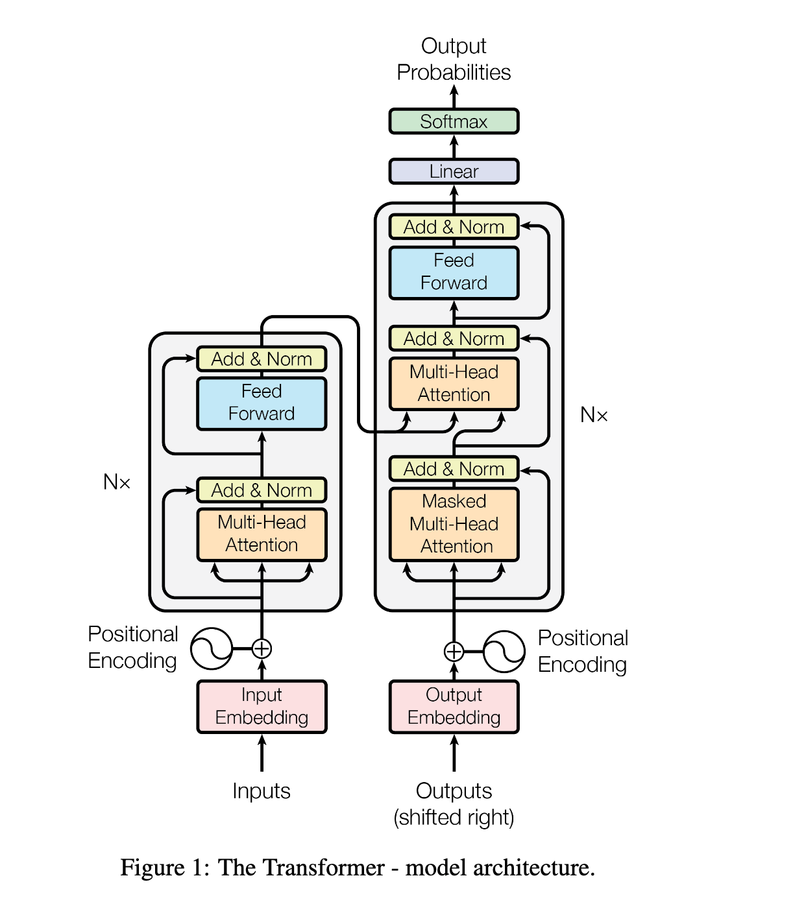
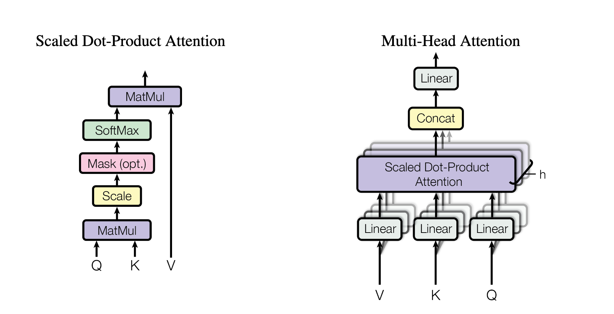

# Attention Is All You Need

## transformer架构

## InputEmbedding

**作用:**该模块负责将输入的离散词元 (token IDs) 转换为连续的密集向量表示 (embeddings)。

**实现方式:**nn.Embedding

`nn.Embedding` 的核心作用就是一个**可学习的、高效的查找表 (Learnable Lookup Table)**。

它的主要任务是将离散的、类别化的数据（比如单词的ID）转换为连续的、密集的向量表示（即**嵌入向量，Embeddings**）。这是自然语言处理（NLP）模型处理文本的第一步。

### 1. 它解决了什么问题？

计算机无法直接理解 "猫"、"狗" 这样的词语。我们需要一种方式将它们转换成数字。

- **一种简单但糟糕的方法是独热编码 (One-Hot Encoding)**。如果我们的词汇表有50,000个词，那么 "猫" 可能会被表示成一个50,000维的向量，其中只有一位是1，其余全是0。这种表示方法有两个致命缺点：
  - **维度灾难**：向量维度太高，计算成本巨大。
  - **无法表达语义**：任意两个词的独热编码都是正交的，无法体现出 "猫" 和 "狗" 比 "猫" 和 "飞船" 关系更近。
- **`nn.Embedding` 提供了解决方案**。它将每个单词映射到一个固定长度的、低维的、密集的浮点数向量（比如512维）。

### 2. 它是如何工作的？

您可以把 `nn.Embedding` 想象成一个内部存储着一个大矩阵的模块，这个矩阵我们称之为**嵌入矩阵 (Embedding Matrix)**。

- **初始化**：在我们的代码 `nn.Embedding(vocab_size, d_model)` 中：
  - `vocab_size`：定义了嵌入矩阵有多少**行**。每一行对应我们词汇表中的一个唯一词元（token）。
  - `d_model`：定义了嵌入矩阵有多少**列**。它也是每个词元转换后的向量维度。
  - 所以，它创建了一个形状为 `(vocab_size, d_model)` 的大矩阵。
- **前向传播 (forward)**：当输入一个由词元ID组成的张量时（例如 `torch.LongTensor([[1, 5, 2]])`），`nn.Embedding` 会执行一个高效的查找操作：
  - 它会取出嵌入矩阵中**索引为1、5、2的行向量**。
  - 最终返回一个由这些向量组成的、更高维度的张量。
  - 输入形状: `(batch_size, seq_len)`
  - 输出形状: `(batch_size, seq_len, d_model)`

### 3. 为什么它如此强大？

最关键的一点是：**嵌入矩阵是可学习的 (trainable)**。

这些向量的初始值是随机的，但在模型训练的过程中，它们会通过反向传播不断地被优化和调整。模型会逐渐学会将**语义上相近的词元映射到向量空间中相近的位置**。

例如，经过充分训练后，"国王" 的向量会与 "女王" 的向量很接近，而 "国王" - "男人" + "女人" 的向量运算结果会非常接近 "女王" 的向量。

## Positional Encoding

**作用:**Transformer本身不包含任何关于序列顺序的信息。该模块通过注入位置信号来解决这个问题。它使用不同频率的正弦和余弦函数来创建位置编码，并将其加到输入嵌入上。

pos就是seq_len, i属于d_model

## LayerNormalization

**作用:对每个样本在特征维度上进行归一化，使其均值为0，方差为1。有助于稳定训练过程，加速收敛，并减弱对初始化方法的敏感性。**

### **nn.Parameter**

`nn.Parameter` 是一个**特殊的张量（Tensor）**，它的核心作用是：**向 `nn.Module` 声明“我是一个需要被学习和更新的模型参数”。**

它本身是一个类，继承自 `torch.Tensor`。当你用 `nn.Parameter()` 包裹一个张量时，这个张量就被赋予了“参数”的身份。

当我们需要可训练的参数时,就要使用**nn.Parameter**

### FeedForwardBlock

**这是Transformer块中的第二个主要子层。它是一个简单的两层全连接网络，对每个位置的表示进行独立的非线性变换。**

数据流:(batch, seq_len, d_model) --> (batch, seq_len, d_ff) --> (batch, seq_len, d_model)

**FFN公式:FFN(x) = (Dropout(max(0, xW1 + b1)))W2 + b2**

用torch实现: self.linear_2(self.dropout(torch.relu(self.linear_1(x))))	max(0,x) 就是relu函数

## MultiHeadAttentionBlock

**模型的核心。它允许模型在不同位置的表示子空间中共同关注来自不同位置的信息。**

## ResidualConnection

**x + Dropout(Sublayer(LayerNorm(x)))**

